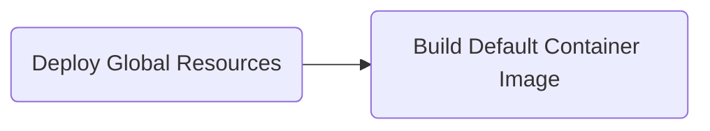
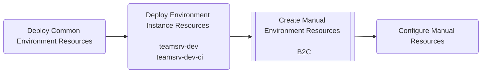
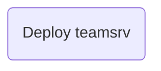
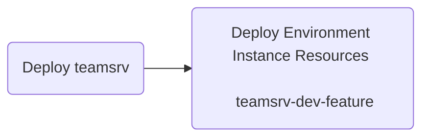
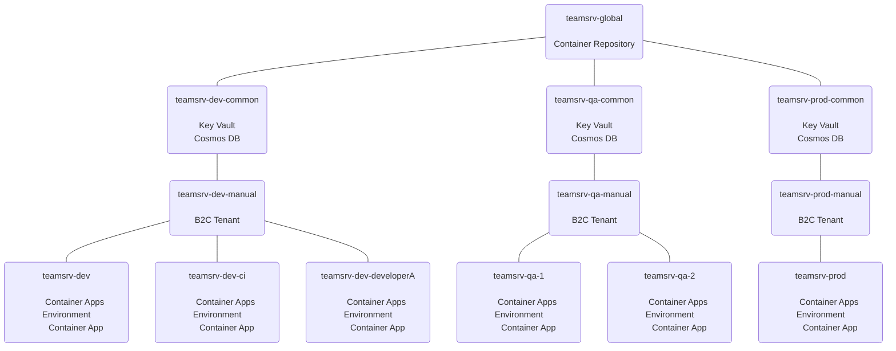

## Global Resources Deployment Flow

Global resources are shared across all environments.   There will not be many of these types of resources because in general you want strict environment seperation.   The container repository is an example of one such resource.  It is shared across all the environments because we want the exact same bits that were compiled and tested to be deployed to production.  This minimizes the risk of hidden and unintended changes from creaping in after testing.  An example of hidden and unintended changes would be new versions of code dependencies being pulled in during a package restore.

## Environment Deployment Flow

Common environment resources are resources that are shared by all the invironment instances.  For example you may decide to share a database to reduce maintainence and mock data creation.  You may also want to share a single key store per environment.  These are long lasting resources that will be recreated less frequently.

Manual resources are created by hand.  In an ideal world there would be no resources created by hand, but some resources do not have the proper support from ARM/Bicep, AZ, or the rest api do be deployed successfully and consistently from a pipeline.  Azure B2C is an example of a resource that needs to be created by hand.  It cannot as of November 2023 be configured with AZ.   The ARM templates have serious limitations.  They can only be deployed once and cannot be modified.  Finally the rest API can only request an autherization token with the "implicit" flow.  It will need to suppor the "client credentials" flow before it is an option.  

## Deploy application

After the environment is fully deployed, deploy the desired version of the application to the desired environment instance.   The environment ci instance will automatically be deployed on each successful build.

## To create multiple environment instances of the application

If there is a use case you can deploy more environment instances.  For example if a developer need to work on their own instance or maybe a new feature needs a dedicated instance.

# Resource Groups
