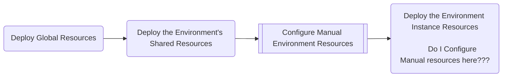
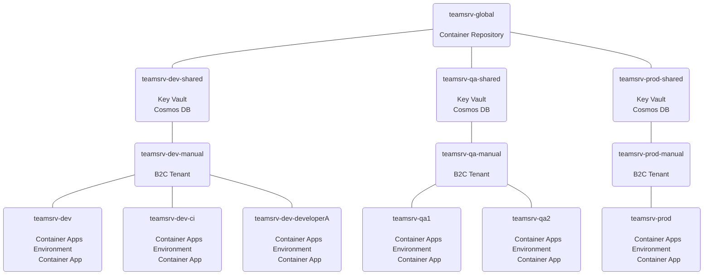

## Environment Deployment Flow

```mermaid

flowchart LR
    A(Deploy Global Resources)
    
    B(Deploy the Environment's Shared Resources)

    C[[Configure Manual Environment Resources]]

    D(
        Deploy the Environment Instance Resources
    
        Do I Configure Manual resources here???
    )

    A --> B --> C --> D
```
# Resource Groups

```mermaid

flowchart

    G(
        teamsrv-global

        Container Repository
    ) 
    G  --- DS(
        teamsrv-dev-shared

        Key Vault
        Cosmos DB
    )
    DS  --- DM(
        teamsrv-dev-manual

        B2C Tenant
    )
    DM --- D1(
        teamsrv-dev

        Container Apps Environment
        Container App
    )
    DM --- D2(
        teamsrv-dev-ci

        Container Apps Environment
        Container App
    )
    DM --- D3(
        teamsrv-dev-developerA
    
        Container Apps Environment
        Container App
    )

    G  --- QS(
        teamsrv-qa-shared

        Key Vault
        Cosmos DB
    )
    QS  --- QM(
        teamsrv-qa-manual

        B2C Tenant
    )
    QM --- Q1(
        teamsrv-qa1

        Container Apps Environment
        Container App
    )
    QM --- Q2(
        teamsrv-qa2

        Container Apps Environment
        Container App
    )

    G  --- PS(
        teamsrv-prod-shared

        Key Vault
        Cosmos DB
    )

    PS  --- PM(
        teamsrv-prod-manual

        B2C Tenant
    )

    PM --- P1(
        teamsrv-prod

        Container Apps Environment
        Container App
    )

```