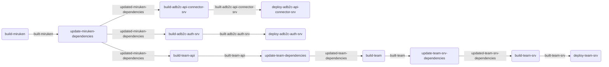

# Events 

```mermaid

flowchart LR
    A(build-miruken) 
    A -- built-miruken                --> B(update-miruken-dependencies)
    B -- updated-miruken-dependencies --> C1(build-adb2c-api-connector-srv)
    B -- updated-miruken-dependencies --> D1(build-adb2c-auth-srv)
    B -- updated-miruken-dependencies --> E1(build-team-api)

    C1 -- built-adb2c-api-connector-srv --> C2(deploy-adb2c-api-connector-srv)
    D1 -- built-adb2c-auth-srv          --> D2(deploy-adb2c-auth-srv)

    E1 -- built-team-api                --> E2(update-team-dependencies)
    E2 -- updated-team-dependencies     --> E3(build-team)
    E3 -- built-team                    --> E4(update-team-srv-dependencies)
    E4 -- updated-team-srv-dependencies --> E5(build-team-srv)
    E5 -- built-team-srv                --> E6(deploy-team-srv)

```